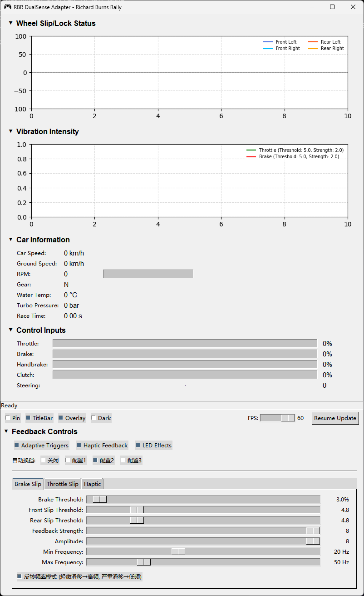

# Richard Burns Rally DualSense Adaptive Trigger

A Python application that provides DualSense (PS5) controller feedback for Richard Burns Rally, enhancing the gaming experience with adaptive triggers, haptic feedback, and dynamic LED effects.



## Features

### Real-time Feedback
- **Adaptive Triggers**: Dynamic resistance based on wheel slip, lock, and vehicle behavior
  - Left Trigger (Brake): Provides feedback for front wheel lock with configurable strength and frequency
  - Right Trigger (Throttle): Simulates wheel spin and traction loss with adjustable parameters
  - Separate threshold controls for front and rear wheel slip detection
  - Customizable feedback strength, amplitude, and frequency ranges
- **Haptic Feedback**: Tactile response for traction loss and surface changes
  - Adjustable intensity based on slip severity
  - Independent brake and throttle slip detection
- **Dynamic LED**: Color changes based on RPM ranges (green → yellow → red)

### Automatic Gear Shifting
- **Intelligent Gear Management**: Automatic gear shifting based on RPM and vehicle speed
  - Three preset configurations (Rally1, Rally2, Rally3) for different car types
  - Customizable shift points for each gear (supports 5/6/7-speed transmissions)
  - Independent upshift and downshift cooldown timers
  - Hot-swap presets with configurable hotkey (default: F9)
  - Optional debug mode for tuning shift points
  - Game window focus detection for safe keyboard input

### Telemetry Dashboard
- Real-time vehicle data visualization
- Wheel slip/lock status graphs
- Vibration intensity monitoring
- Control input display
- Automatic gear shift status indicator
- Customizable UI with dark/light themes
- In-game overlay support (optional)

## Requirements

- Windows 10/11
- Python 3.8 or higher
- Richard Burns Rally SSE
- DualSense (PS5) controller
- You need to connect your PS5 DualSense Joystick with DualSenseY-v2 to work: https://github.com/WujekFoliarz/DualSenseY-v2

## Installation

1. Clone this repository or download the latest release
2. Install required Python packages:
   ```bash
   pip install -r requirements.txt
   ```
3. (Optional) Install additional dependencies for automatic gear shift and overlay features:
   ```bash
   pip install pydirectinput keyboard pywin32
   ```
4. Ensure DSX is running and your DualSense controller is connected
5. Launch Richard Burns Rally
6. Run the script:
   ```bash
   python Adaptive_Trigger_RBR.py
   ```

## Configuration

The application uses a `config.ini` file for customization:

### Features
```ini
[Features]
adaptive_trigger = True    # Enable adaptive trigger feedback
led_effect = True          # Enable LED color effects
haptic_effect = True       # Enable haptic feedback
print_telemetry = True     # Print telemetry data to console
use_gui_dashboard = True   # Show GUI dashboard
```

### Feedback Settings (Legacy)
```ini
[Feedback]
trigger_strength = 2.0      # Legacy parameter (0.1-2.0)
haptic_strength = 1.0       # Haptic feedback intensity (0.0-1.0)
wheel_slip_threshold = 5.0  # Wheel slip detection sensitivity (5.0-30.0)
```

### Brake Slip Settings
```ini
[BrakeSlip]
brake_threshold = 3.0           # Brake input threshold (0.1-99.0)
front_slip_threshold = 5.0      # Front wheel slip threshold (1.0-20.0)
rear_slip_threshold = 5.0       # Rear wheel slip threshold (1.0-20.0)
feedback_strength = 7           # Feedback strength intensity (1-10)
amplitude = 5                   # Vibration amplitude (1-10)
min_frequency = 25              # Minimum frequency (1-255)
max_frequency = 85              # Maximum frequency (1-255)
reverse_frequency_mode = False  # Reverse frequency scaling
```

### Throttle Slip Settings
```ini
[ThrottleSlip]
throttle_threshold = 3.0        # Throttle input threshold (0.1-99.0)
front_slip_threshold = 5.0      # Front wheel slip threshold (1.0-20.0)
rear_slip_threshold = 5.0       # Rear wheel slip threshold (1.0-20.0)
feedback_strength = 8           # Feedback strength intensity (1-10)
amplitude = 4                   # Vibration amplitude (1-10)
min_frequency = 30              # Minimum frequency (1-255)
max_frequency = 96              # Maximum frequency (1-255)
reverse_frequency_mode = False  # Reverse frequency scaling
```

### Automatic Gear Shift Settings
```ini
[GearShift]
auto_gear_shift = False         # Enable automatic gear shifting
gear_up_key = e                 # Key for upshift
gear_down_key = q               # Key for downshift
shift_up_cooldown = 1.0         # Upshift delay (0.1-1.0 seconds)
shift_down_cooldown = 0.5       # Downshift delay (0.1-1.0 seconds)
active_preset = 2               # Active preset (1=Rally1, 2=Rally2, 3=Rally3)
preset_switch_key = F9          # Key to switch between presets
gear_shift_debug = False        # Enable debug output

[GearShift_Rally1]
shift_up_rpm = 8000,7800,6900,6800,6800,6800      # RPM for upshifts (1→2, 2→3, 3→4, 4→5, 5→6, 6→7)
shift_down_rpm = 3000,3500,4500,4500,5000,5000    # RPM for downshifts (2→1, 3→2, 4→3, 5→4, 6→5, 7→6)

[GearShift_Rally2]
shift_up_rpm = 6800,6500,6300,6000,5800,5500
shift_down_rpm = 2500,2800,3500,4000,4000,4300

[GearShift_Rally3]
shift_up_rpm = 9500,9400,9400,9400,9400,9400
shift_down_rpm = 6000,6300,6500,6800,7000,7000
```

### GUI Settings
```ini
[GUI]
fps = 60.0                 # Dashboard update rate (10-60 FPS)
pause_updates = False      # Pause dashboard updates
language = en              # Interface language (en/zh)
```

### UI Overlay Settings
```ini
[UI]
show_overlay = False       # Show in-game overlay
```

### Network Settings
```ini
[Network]
udp_port = 6776           # UDP port for telemetry data
```

## Dashboard Controls

- **Pin Window**: Keep dashboard on top
- **Show Title Bar**: Toggle window title bar
- **Dark Theme**: Switch between light/dark themes
- **Transparency**: Adjust window transparency
- **FPS**: Control dashboard update rate
- **Pause Update**: Freeze dashboard updates

## Feature Details

### Adaptive Triggers
- **Brake Trigger (Left)**: 
  - Dynamic resistance based on front wheel lock
  - Separate threshold for front and rear wheels
  - Customizable feedback strength and amplitude
  - Adjustable frequency range for different feel
  - Optional reverse frequency mode
  
- **Throttle Trigger (Right)**:
  - Resistance based on wheel spin during acceleration
  - Independent slip detection for front and rear wheels
  - Fine-tuned feedback parameters
  - Speed-sensitive behavior
  - Handbrake integration

### Automatic Gear Shifting
- **How it works**:
  - Monitors engine RPM and current gear
  - Automatically shifts up when reaching optimal RPM
  - Downshifts when RPM drops below minimum threshold
  - Respects cooldown timers to prevent rapid shifting
  - Only operates when game window is focused
  
- **Three Rally Presets**:
  - **Rally1**: High-RPM aggressive shifting (8000-9500 RPM upshifts)
  - **Rally2**: Balanced mid-range performance (6000-6800 RPM upshifts) 
  - **Rally3**: Ultra-high-RPM racing (9400-9500 RPM upshifts)
  
- **Customization**:
  - Each preset has 6 shift points (supports 5/6/7-speed cars)
  - Independent upshift and downshift RPM values
  - Adjustable cooldown timers prevent premature shifting
  - Press F9 (default) to cycle between presets during gameplay
  - Debug mode shows shift decisions in console

### LED Effects
- **Green** (< 60% max RPM): Normal operation
- **Yellow** (60-80% max RPM): Approaching redline
- **Red** (> 80% max RPM): Redline warning

### Haptic Feedback
- Wheel slip/spin detection with separate brake and throttle thresholds
- Traction loss feedback with adjustable intensity
- Frequency-based vibration (configurable min/max range)
- Amplitude control for different severity levels
- Configurable thresholds and strength for each trigger

## Troubleshooting

1. **No Controller Feedback**
   - Ensure DSX is running
   - Check controller connection
   - Verify UDP port settings (default: 6776)
   - Check if `adaptive_trigger` is enabled in config

2. **Game Not Detected**
   - Run the script as administrator
   - Verify RBR is running
   - Check process name matches (RichardBurnsRally_SSE.exe)

3. **Automatic Gear Shift Not Working**
   - Install optional dependencies: `pip install pydirectinput keyboard pywin32`
   - Enable `auto_gear_shift` in config.ini
   - Ensure game window has focus
   - Verify gear shift keys match your game controls
   - Check if shift cooldown timers are too long
   - Enable `gear_shift_debug` to see shift events in console

4. **Performance Issues**
   - Reduce dashboard FPS in GUI settings
   - Disable unused features (LED, haptic, adaptive triggers)
   - Lower feedback strength and frequency parameters
   - Check system resources
   - Disable in-game overlay if not needed

5. **Feedback Too Weak/Strong**
   - Adjust `feedback_strength` in BrakeSlip/ThrottleSlip sections
   - Modify `amplitude` values (1-10 range)
   - Change frequency ranges (min_frequency, max_frequency)
   - Try `reverse_frequency_mode` for different feel
   - Adjust slip thresholds to trigger earlier/later

## Contributing

Contributions are welcome! Please feel free to submit pull requests or create issues for bugs and feature requests.

## License

This project is licensed under the MIT License - see the LICENSE file for details.

## Acknowledgments

- Richard Burns Rally community
- DSX project contributors
- Python gaming community

## Disclaimer

This project is not affiliated with or endorsed by Sony Interactive Entertainment LLC or the creators of Richard Burns Rally. 