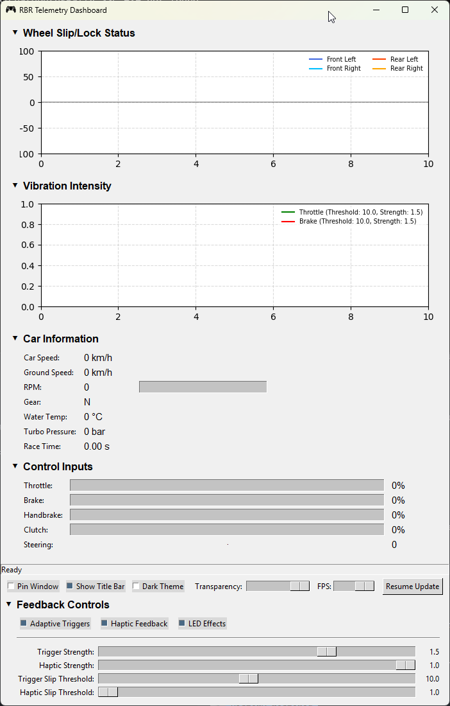

# Richard Burns Rally DualSense Adaptive Trigger

A Python application that provides DualSense (PS5) controller feedback for Richard Burns Rally, enhancing the gaming experience with adaptive triggers, haptic feedback, and dynamic LED effects.



## Features

### Real-time Feedback
- **Adaptive Triggers**: Dynamic resistance based on wheel slip, lock, and vehicle behavior
  - Left Trigger (Brake): Provides feedback for front wheel lock
  - Right Trigger (Throttle): Simulates wheel spin and traction loss
- **Haptic Feedback**: Tactile response for traction loss and surface changes
- **Dynamic LED**: Color changes based on RPM ranges (green → yellow → red)

### Telemetry Dashboard
- Real-time vehicle data visualization
- Wheel slip/lock status graphs
- Vibration intensity monitoring
- Control input display
- Customizable UI with dark/light themes

## Requirements

- Windows 10/11
- Python 3.8 or higher
- Richard Burns Rally SSE
- DualSense (PS5) controller
- DSX (DualSense Windows Extended) running

## Installation

1. Clone this repository or download the latest release
2. Install required Python packages:
   ```bash
   pip install -r requirements.txt
   ```
3. Ensure DSX is running and your DualSense controller is connected
4. Launch Richard Burns Rally
5. Run the script:
   ```bash
   python Adaptive_Trigger_RBR.py
   ```

## Configuration

The application uses a `config.ini` file for customization:

### Features
```ini
[Features]
adaptive_trigger = True
led_effect = True
haptic_effect = True
print_telemetry = True
use_gui_dashboard = True
```

### Feedback Settings
```ini
[Feedback]
trigger_strength = 1.0      # Adaptive trigger strength (0.1-2.0)
haptic_strength = 1.0       # Haptic feedback intensity (0-1.0)
wheel_slip_threshold = 10.0 # Wheel slip detection sensitivity (1.0-20.0)
trigger_threshold = 1.0     # Haptic trigger threshold (1.0-20.0)
```

### GUI Settings
```ini
[GUI]
fps = 60.0                 # Dashboard update rate (10-60 FPS)
pause_updates = False      # Pause dashboard updates
```

### Network Settings
```ini
[Network]
udp_port = 6776           # UDP port for telemetry data
```

## Dashboard Controls

- **Pin Window**: Keep dashboard on top
- **Show Title Bar**: Toggle window title bar
- **Dark Theme**: Switch between light/dark themes
- **Transparency**: Adjust window transparency
- **FPS**: Control dashboard update rate
- **Pause Update**: Freeze dashboard updates

## Feature Details

### Adaptive Triggers
- Provides resistance based on:
  - Wheel slip during acceleration
  - Brake lock-up
  - Handbrake usage
  - Vehicle speed and behavior

### LED Effects
- **Green** (< 60% max RPM): Normal operation
- **Yellow** (60-80% max RPM): Approaching redline
- **Red** (> 80% max RPM): Redline warning

### Haptic Feedback
- Wheel slip/spin detection
- Traction loss feedback
- Intensity varies with severity
- Configurable thresholds and strength

## Troubleshooting

1. **No Controller Feedback**
   - Ensure DSX is running
   - Check controller connection
   - Verify UDP port settings

2. **Game Not Detected**
   - Run the script as administrator
   - Verify RBR is running
   - Check process name matches

3. **Performance Issues**
   - Reduce dashboard FPS
   - Disable unused features
   - Check system resources

## Contributing

Contributions are welcome! Please feel free to submit pull requests or create issues for bugs and feature requests.

## License

This project is licensed under the MIT License - see the LICENSE file for details.

## Acknowledgments

- Richard Burns Rally community
- DSX project contributors
- Python gaming community

## Disclaimer

This project is not affiliated with or endorsed by Sony Interactive Entertainment LLC or the creators of Richard Burns Rally. 